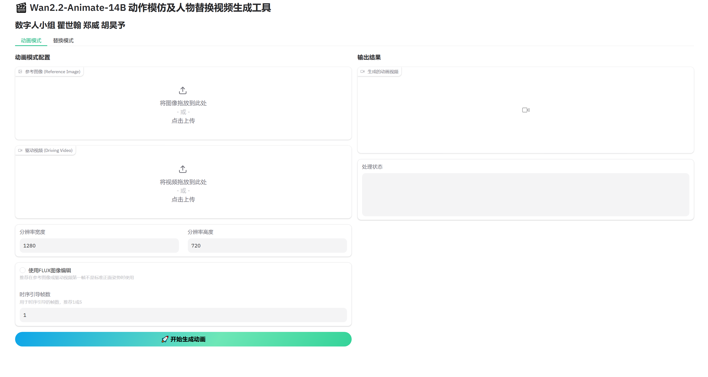
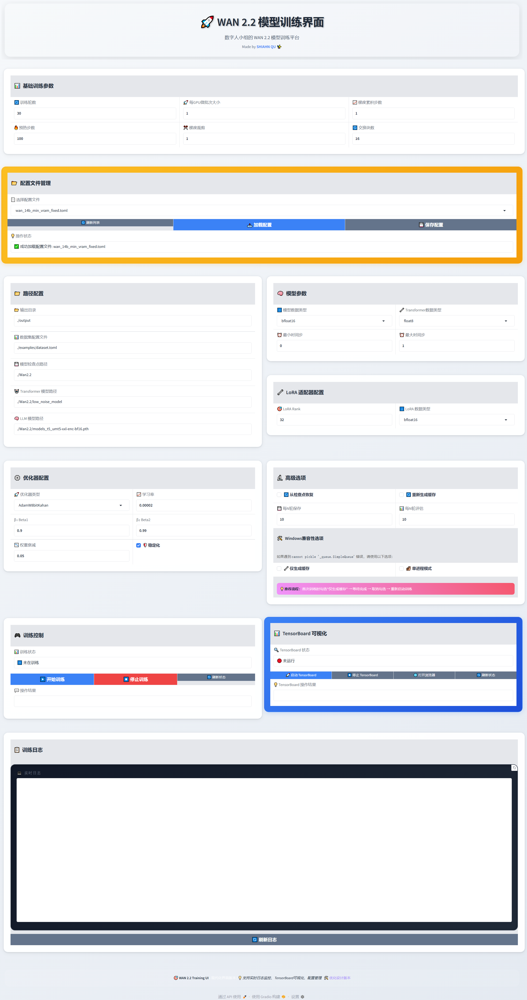

# Wan2.2 Digital Human

面向二维角色与远景人物动画的 Wan2.2-Animate 科研/工程项目。本仓库重点保存本项目的推理入口、训练策略配置和可复现说明，不分发基础模型权重、训练 checkpoint、缓存或第三方项目的完整副本。

## 项目贡献

Wan2.2-Animate 在写实近景人物上效果较好，但二维角色容易出现面部形变，远景人物的动作一致性也会下降。本项目采用按扩散噪声区间解耦的双 LoRA 方案：

- 低噪声 LoRA：侧重二维角色面部与局部细节稳定性。
- 高噪声 LoRA：侧重远景姿态、全局运动轨迹和时序一致性。
- 推理时按任务加载相应 LoRA，在保留基础模型能力的同时进行定向增强。

## 仓库结构

```text
.
├── start.py                     # Gradio 推理界面
├── API Version.py               # API/网页版本入口
├── generate.py                  # 命令行生成入口
├── wan/                         # 项目运行所需的 Wan 推理代码
├── training/                    # 双 LoRA 训练命令与复现说明
├── asset/                       # README 使用的少量截图
├── docs/                        # GitHub Pages 演示页
├── requirements.txt
└── INSTALL.md
```

模型权重、SAM2、DiffSynth Studio、训练数据和运行输出均不纳入 Git。完整安装步骤见 [INSTALL.md](INSTALL.md)，训练复现见 [training/README.md](training/README.md)。

## 快速开始

```bash
git clone https://github.com/qued02/Wan2.2-digital-human.git
cd Wan2.2-digital-human
python -m venv .venv
```

Windows：

```powershell
.venv\Scripts\Activate.ps1
pip install -r requirements.txt
```

完成 [第三方依赖安装](INSTALL.md#2-第三方源码依赖) 后启动：

```bash
python start.py
```

首次启动会通过 ModelScope 下载 `Wan-AI/Wan2.2-Animate-14B`。该模型体积很大，请预留足够的磁盘空间和显存；模型许可证与使用限制以模型发布页为准。

## 界面





## 第三方依赖与来源

| 组件 | 用途 | 来源 |
| --- | --- | --- |
| Wan2.2 / Wan-Animate | 基础视频生成与角色动画 | [Wan-Video/Wan2.2](https://github.com/Wan-Video/Wan2.2) |
| DiffSynth Studio | 推理管线及 Linux LoRA 训练后端 | [modelscope/DiffSynth-Studio](https://github.com/modelscope/DiffSynth-Studio) |
| SAM 2 | 人物/视频分割预处理 | [facebookresearch/sam2](https://github.com/facebookresearch/sam2) |
| diffusion-pipe | 可选的流水线并行训练后端 | [tdrussell/diffusion-pipe](https://github.com/tdrussell/diffusion-pipe) |
| Wan2.2-Animate-14B | 基础模型文件 | [ModelScope: Wan-AI/Wan2.2-Animate-14B](https://modelscope.cn/models/Wan-AI/Wan2.2-Animate-14B) |

第三方组件仍受各自许可证约束。本仓库不重新分发其完整源码或模型权重。

## 不纳入仓库的内容

- `*.safetensors`、`*.pt`、`*.pth`、checkpoint 和 LoRA 输出；
- 训练数据、latent/text-embedding cache、日志与生成视频；
- 本地 Python 环境、下载缓存和第三方仓库工作副本。

## License

本仓库代码沿用 [Apache License 2.0](LICENSE.txt)。使用基础模型和第三方组件时，请同时遵守对应项目的许可证及模型条款。
